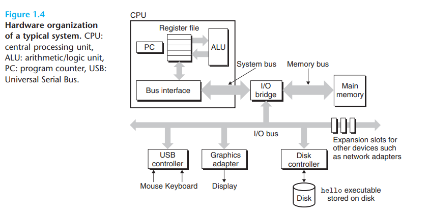
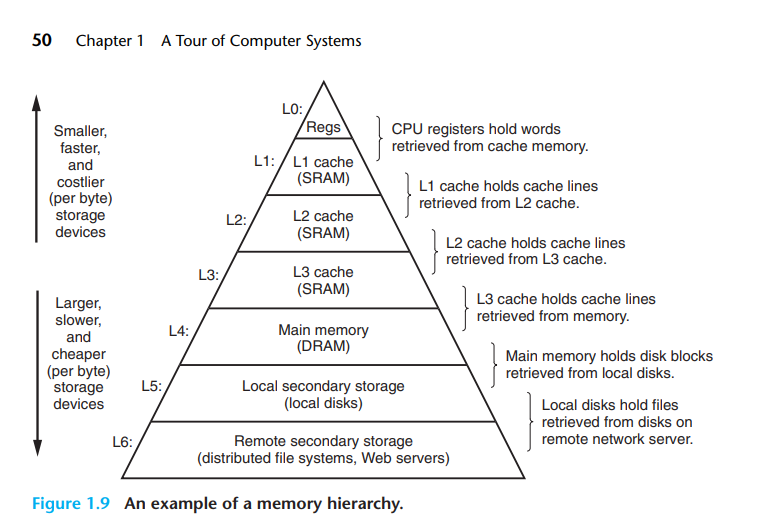
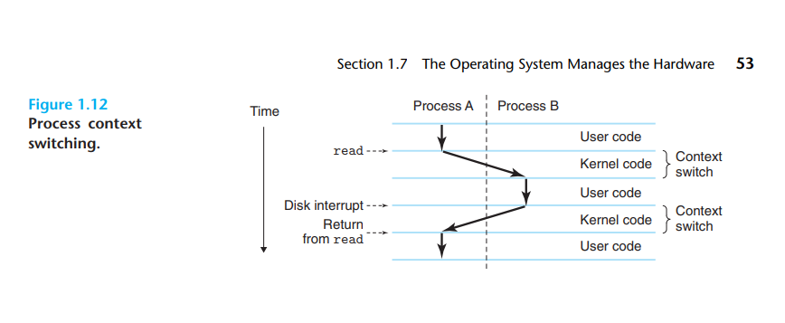
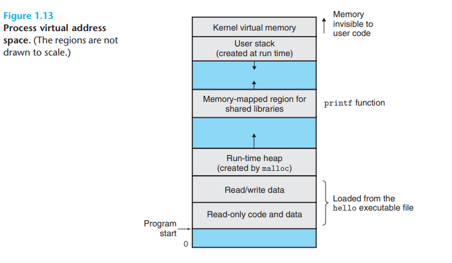
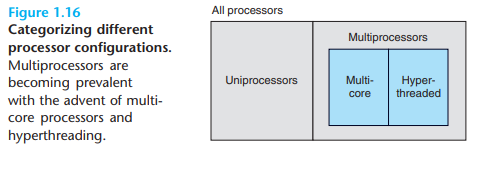
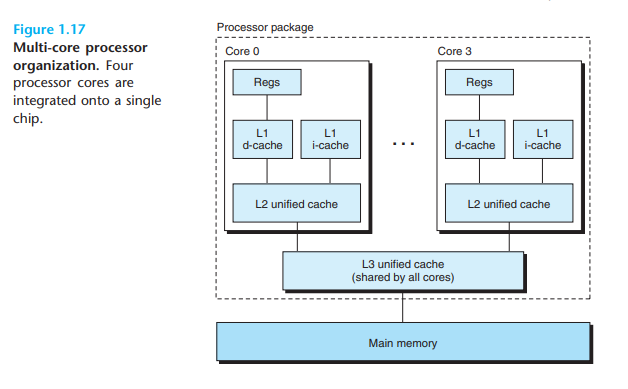

# Chapter 1
# 1.1 A Tour of Computer Systems

## how does hello.c really run? 

1. `source program/file` - hello.c, sequence of bits, organized in 8-bit chunks called bytes
2. Represented each character with unique byte-size integer value using ASCII
3. translated into different forms -> `executable object program`
4. sequence of `low-level machine-language instruction` (translated by other program), also called `executable object program`, stored as a `binary disk file`

        linux> gcc -o hello hello.c

- **pre-processing phase** (#include<studio.h>), **hello.c** tells the preprocessor to read the contents of header file stdio.h and insert it directly into the program text -> .i suffix
- **compilation phase** compiler (cc1) translates the text file **hello.i** into text file **hello.s** (contains only assembly-language)
- C compilers and Fortran compilers both
generate output files in the same assembly language : assembly provides common output lanugage for different compilers
- **Assembly phase** assembler(as) translates hello.s into machine-lanuage instruction in text form -> *relocatable object program* **hello.o**
- **Linking Phase** printf function resides in a separated precompiled object file called printf.o
  - merge printf.o, hello.o (linker ld handles this merging) -> **hello** file -> executable object file: ready to be loaded into memory and executed by the system

## it pays to understand how compilation systems work

1. optimizing program performance

> As programmers, we do not need to know
the inner workings of the compiler in order to write efficient code. However,
in order to make good coding decisions in our C programs, we do need a
basic understanding of machine-level code and how the compiler translates
different C statements into machine code. For example, is a switch statement
always more efficient than a sequence of if-else statements?

2. understanding link-time error

> what does it mean when the linker reports that it cannot resolve a reference? What is the
difference between a static variable and a global variable? What happens if
you define two global variables in different C files with the same name? 

3. avoiding security holes 

> buffer overflow vulnerabilities have
accounted for many of the security holes in network and Internet servers. A first step in learning secure programming is to understand the consequences of the way data and control information are stored on the program
stack.

## Processors read and interpret Instructions stored in memory

shell: if the first word of the command line does not correspond to a built-in shell command, then the shell assumes that it is the name of executable file that it should load and run

**How does hardware orgranization of a system run hello.c**

1. Buses, electrical conduits, carry bytes of infomration back and forth between components, designed to transfer fixed-size chunks of bytes known as *words*, 4/8 bytes.
2. I/O devices, system connection to external world. Keyboard, mouse, display, disk. Each I/O device is connected to the I/O bus by either a *controller* or an *adapter*
3. Main Memory, temporary storage device holds both a program and the data it manipulates while processor is executing the program. Logically, memory is organized as a linear array of bytes, each with its own unique address (array index) starting at zero.
4. Processor, CPU, engine that interprets/executes instructions store in main memory
   1. core -> word-size storage device (register) called *program counter* PC, at any point in time, PC points at some machine-lanuage instruction in main memory
   2. from the time power is applied, processor repeatedly executes the instruction pointed at by PC and updates the PC to point to the next instruction. Operating according to a very simple **instruction excution model**, defined by its `instruction set architecture`
      1. processor reads the instruction from memory pointed at by PC
      2. interprets the bits in the instruction
      3. performs simple operation dictacted by the instruction
      4. updates the PC to point to the next instruction (may or may not be contiguous in memory to the instruction that was just executed)
         1. only a few of these simple operations, they revovled around main memory - `register file` and the `arithmetic/logic unit` (ALU)
            1. Register file -> storage device
            2. ALU -> arithmetic/logic unit -> computes new data and address values
               1. Load: copy a byte or a word from main memory into a register, overwriting previous contents of the register
               2. Store: copy a byte or a word from a register to a location in main memory
               3. Operate: copy the contents of two registers to ALU, perform an arithmetic operation on the two words, and store the result in a register, overwriting the previous contents of that register
               4. Jump: extract a word from the instruction itself and copy that word into PC, overwriting the previous value of the PC
   3. Processor appears to be a simple implementation of its instruction set architecture, but far more complext to speed up program execution.

### Running the hello program

- shell program reads each one of characters ./hello into a register and then stores it in memory
- when we hit the `enter`, shell knows we finished typing, then loads the executable hello file by executing a sequence of instructions that copies the code and data in hello object from disk to memory
- using `direct memory access (DMA)` data travel directly from disk to main memory
- after executing machine-language instructions in the *hello* program's main routine, instruction copy the bytes in `hello world\n` string from memory to the register file, and from there to the display device

## Caches Matter

> the data string hello,world\n, originally on disk, is copied to main memory and then copied
from main memory to the display device

> From a programmer’s perspective, much
of this copying is overhead that slows down the “real work” of the program. Thus,
a major goal for system designers is to make these copy operations run as fast as
possible

1. it takes the processor 10,000,000 times longer to read a word from disk than from memory
2. processor can read data from the register file 100 times faster than memory - a few hundred bytes
3. cache memories serve as temporary staging area for information that the processor is likely to need in the near future
4. L1 cache - ten thousands of bytes, as fast as register file
5. L2 cache - hundreds of thousands to millon bytes: 5-10 times faster than memory - connected to CPU by a special bus

> As we move from the top of the hierarchy to the bottom, the devices become slower, larger, and less costly per byte. The register file occupies the top level in the hierarchy, which is known as level 0 or L0. We show three levels of caching L1 to L3, occupying memory
hierarchy levels 1 to 3. Main memory occupies level 4, and so on.

## Operating System Manages the Hardware

operating system as a layer of software interposed between the application program and the hardware.

Operating System has two primary purposes:
  1. protect the hardware from misuse by runaway applications
  2. provide applications with simple and uniform mechanisms for manipulating complicated and often wildly different low-level hardware devices

## Processes

when a program such as `hello` runs on a modern system, it appears to have exclusive use both the processor, main memory and I/O devices.

**A process is the operating system's abstraction for a running program.** In
most systems, there are more processes to run than there are CPUs to run them.

> Traditional systems could only execute one program at a time, while newer multicore processors can execute several programs simultaneously. In either case, a single CPU can appear to execute multiple processes concurrently by having the ** processor switch** among them. The operating system performs this interleaving
with a mechanism known as **context switching**.

The state information that process needs in order to run is kept by operating system: state (context):
  1. current values of the PC
  2. the register file
  3. contents of main memory

when operating system decides to transfer control from the current process to some new process, it performs a *context switch* by saving the context of the current process, restoring the context of the new process, and then passing control to the new process:

The transition from one process to another is managed by the operating system - *kernal*, which is the portion of the operating system code that is always resident in memory

> When an application program
requires some action by the operating system, such as to read or write a file, it executes a special system call instruction, transferring control to the kernel. The kernel then performs the requested operation and returns back to the application
program. Note that the kernel is not a separate process. Instead, it is a collection of code and data structures that the system uses to manage all the processes.

## Threads

a process can actually consist of **multiple execution units**, called **threads**. Process shares the same code and global data, threads are an increasingly important programming model because concurrency, easier to share data between threads than processes.

## Virtual Memory

virtual memory is an abstraction that provides each process with the illusion that it has exclusive use of the _main memory_.

Each process has the same uniform view of memory, known as _virtual address space_.

low region of the address holds the code and data defined by user's process, topmost region of the address space is reserved for code and data in the operating system that is common to all process.

Address in the figure increases from the bottom to the top.

Virtual address space seen by each process consists of a number of well defined areas:
1. _program code and data_: code begins at the same fixed address for all processes, followed by data collections that correspond to global C variables, this area is initalized directly from the contents of an excutable object file: hello excutable
2. _heap_: code and data areas are followed immediately by the run-time _heap_, heap expands and contracts dynamically at run time as result of calls to C standard libary routines such as `malloc` and `free`
3. _shared libararies_: middle of the address space is an area that holds the code and data for shared library
4. _stack_: at the top of user's virtual address space is _user stack_ that the compiler uses to implement function calls, expands and contracts dynamically during the execution of program, each time we call a function, stack grows; each time we return a function, it contracts.
5. _kernel virtual memory_: top region of the address space is reserved for kernel, application not allowed the read/write the contents of this area, however, they can invoke the kernel to perform these operations 

> For virtual memory to work, a sophisticated interaction is required between the hardware and the operating system software, including a hardware translation of every address generated by the processor. The basic idea is to store the contents of a process’s virtual memory on disk and then use the main memory as a cache
for the disk.

### Files

Sequence of bytes, all input and output in the system is performed by reading/writing files, using a small set of system calls known as _Unix I/O_.

## Networks

When the system copies a sequence of bytes from main memory to the network adapter, the data flow across the network to another machine, instead of, say, to a local disk drive. Similarly, the system can read data sent from other machines and copy these data to its main memory.

## Important Themes

### Amdahl's Law

> The main idea is that when we speed up one part of a system, the effect on the overall system performance depends on both how significant this part was and how much
it sped up.

$$S = {1 \over{(1-\alpha) + \alpha/k}}$$

consider the case where a part of the system that initially consumed 60% of the time (α = 0.6) is sped up by a factor of 3 (k = 3).

1/[0.4 + 0.6/3] = 1.67X 

> To significantly speed up the entire system, we must improve the speed of a very
large fraction of the overall system.

## Concurrency and Parallelism

1. we want them to do more
2. we want them to run faster

We use the term _concurrency_ to refer to the general concept of a system with multiple, simultaneous activities, and the term _parallelism_ to refer to the use of concurrency to make a system run faster. 

### Thread-level Concurrency

Multiple control flows executing within a single process.
- traditionally, the concurrent execution was only _simulated_ by having single computer rapidly switch among its executing processes
  -  This form of concurrency allows multiple users to interact with a system at the same time, such as when many people want to get pages from a single Web server
  -  It alsoallows a single user to engage in multiple tasks concurrently, such as having a Web browser in one window, a word processor in another, and streaming music playing at the same time.
  -  Until recently, most actual computing was done by a single processor, even if that processor had to switch among multiple tasks. This configuration is known as a __uniprocessor system__.
-  __system consists of multiple processors all under the control of a single operating system kernal__ -> _multiprocessor system_.
   -  __multi-core processors__ and __hyperthreading__
   - multi-core processors have server CPUs (cores) onto a single integrated-circuit chip
   - 

chip has 4 CPU cores
- each has L1 and L2 Caches
  - L1 splits to two:
    - one hold recently feteched instructions
    - one holds data
  - Cores share high levels of cache and interface to main memory

__Hyperthreading__, _simultaneous multi-threading_, allow single CPU execute multiple flows of control. It involves having multiple copies of CPU hardware, such as PC and register files.

> For example, if one thread must wait for some data to be loaded into a cache, the
CPU can proceed with the execution of a different thread. 

As an example, the Intel Core i7 processor can have each core executing two threads, and so a four-core
system can actually execute eight threads in parallel.

The use of multiprocessing can improve system performance in two ways
1. reduce need to simulate concurrency when performing multiple tasks
2. it can run a single application faster, only if that program is expressed in terms of multiple threads that can effectively execute in parallel

### Instruction-level parallism

Modern precessors can execute multiple instructions at one time.

The speed of a computer processor, or CPU, is determined by the Clock Cycle, which is the amount of time between two pulses of an oscillator. 

Generally speaking, the higher number of pulses per second, the faster the computer processor will be able to process information. 

For example, a 4GHz processor performs 4,000,000,000 clock cycles per second. Computer processors can execute one or more instructions per clock cycle, depending on the type of processor.

### Single-instruction, Multiple-Data Parallelism (SIMD)

many modern processors have speical hardware that allows a single instruction to cause multiple operations to be performed in parallel.

> For example,
recent generations of Intel and AMD processors have instructions that can add 8
pairs of single-precision floating-point numbers (C data type float) in parallel.
These SIMD instructions are provided mostly to speed up applications that
process image, sound, and video data.

In C, `vector` data types supported in compilers such as GCC

#### Abstraction

__application program interface (API) for a set of functions that allow programmers
to use the code without having to delve into its inner workings.__

Operating System:
1. files as an abstraction of I/O devices
2. virtual memory as an abstraction of program memory
3. processes as an abstraction of running program
4. virtual machine, abstration of the entire computer, including operating system, processor, and the program

## Summary

programs are translated by other programs into different forms: ASCII text -> translated by compilers -> linkers -> binary executable files 

Processor read and interpret binary instructions that stored in the main memory, programmers can optimize the performance of their C programs by understanding end exploiting the memory hierarchy.

The operating system kernel serves as an intermediary between the application and the hardware. It provides three fundamental abstractions: (1) Files are
abstractions for I/O devices. (2) Virtual memory is an abstraction for both main
memory and disks. (3) Processes are abstractions for the processor, main memory,
and I/O devices.
Finally, networks provide ways for computer systems to communicate with
one another. From the viewpoint of a particular system, the network is just another
I/O device.

# Chapter 2

## 2.1 Information Storage

most computers use blocks of 8 bits, or bytes as the smallest addressable unit of memeory. A machine-level program views memory as a very large array of bytes, as _virtual memory_, every byte of memory is identified by a unique number, known as its _address_, set of all possible addresses is known as _virtual address space_

Pointer in C, whether it points to an integer, a structure or some other program object--is the virtual address of the first byte of some block of storage. 

C compiler also associates _type_ information with each pointer, -> generate different machine-level code to access value stored at the location designated by the pointer depending on the type of that value.