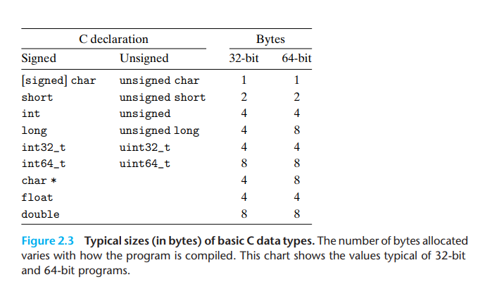

# Representing and Manipulating Information

## Information Storage

- A machine-level program views memory as a very large array of bytes, referred to as _virtual memory_. 

- Every byte of memory is identified by a unique number, known as its _address_.

- Set of all possible addresses is known as _virtual address space_.

- compiler and run-time system partitions this memory space into more manageable units to store the different _program objects_: program data, instruction and control information.

- Value of a pointer in C, whether it's an integer, structure or program object, is the virtual address of the first byte of some block of storage.

- C compiler also associates _type_ information with each pointer.

### Hexadecimal Notation

Binary notation is too verbose, while with decimal notation it is tedious to convert to and from bit patterns. Instead, we write bit patterns as base-16, or hexadecimal numbers

you convert binary to hexadecimal by first splitting it into groups of 4 bits each.

$x = 2 ^ n$, binary representation of x is simply 1 followed by _n_ zeros.

Hexadecimal digit 0 represents 4 binary zeros. Therefore:

_n_ written in the form $i+4j$

leading hex digit 1 (i=0), 2 (i=1), 4 (i=2) or 8 (i=3)

$x = 2 ^ {11} \\ n= 11 = 3 + 4 * 2
\\ 0x800$


convert decimal number x to hexadeciaml

$x = q * 16 + r$

### Data sizes

Every computer has a _world size_, nominal size of pointer data, virtual address is encoded by such a word, system parameter determined by the word size is the maximum size of the virtual address space.

for a machine with w-bit word size, virtual address range from 0 to $2^w-1$.

machines shift with 32-bit word sizes to those with word sizes of 64 bits

32-bit word size limits VAS (_virtual address space_) to 4 gigabytes.

64-bit word size leads to 16 exabytes.

    linux> gcc -m32 prog.c
    linux> gcc -m64 prog.c

Word "size" refers to the amount of data a CPU's internal data registers can hold and process at one time.

word size 就是 字， 字长是32位， 则最多能表达到 $2^{32}-1$ 这个位置， 也就是刚好4GB。哪怕我给了5G内存，超过4G的部分，由于无法表达，也无法存储到那个位置了。

64-bit program， 可能会利用超过 $2^{32}-1$ 这个数值的内存地址，无法在32-bit的处理器上运行，因为所表达的地址大于32位的极限。



```
For any data type T:

T *p;

indicates that p is a pointer variable, pointing to an object of type T

char *p;

is the declartaion of a pointer to an object of type char.
```

