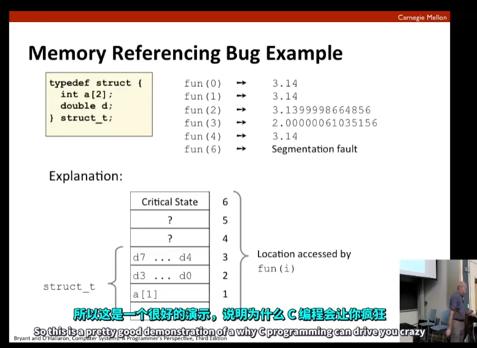
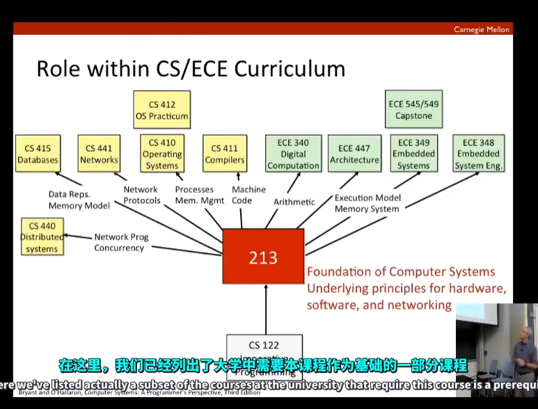

# Course Overview

## Great Reality #1: Ints are not integers, Floats are not Reals

1. 50000 * 50000 -> exceeds signed $2^{32}$ -> ends up a negative value
2. is (x+y) + z = x + (y + z) -> no as for floats

`All it all comes down to a fact that they use finite representations of things that are potentially infinite in their expense`

Int can overflow and run out of room.

Floating point numbers have roundoff problems where you sort of drop the digits that aren't significant

## Computer Rithmetic

1. does not generate random values
2. cannot assume all usual mathematical properties
   1. due to finiteness of representations
3. observation
   1. need to understand which abstrations apply in which contexts  

`anytime you have possible for corner cases you have to understand these nuances better`

## Great Reality # 2: You've got to know Assembly

1. chances are, you willl never write programs in assembly
   1. compilers are much better & more patient than you are
2. But: Understanding assembly is key to machine-level execution model

`This course is more about taking the assembly code that's been generated by a compiler to read it and understand it`

3. in particular we are going to look at the language of intel processors x86-64, the 64-bit version of their instruction set

## Great Reality #3： Memory Matters - Random Access Memory is Unphysical Abstration

### Memory Referencing Errors

1. C and C++ do not provide any memory protection
   1. Out of bounds array references
   2. Invalid pointer values
   3. abuses of malloc/free
2. can lead to nasty bugs
3. how can I deal with this?
   1. program in Java

## Great Reality #4: There's more performance than asymptotic complexity

## Great Reality #5: Computers do more than execuate programs

1. they need to get data in and out I/O
2. they communicate with each other over networks
   1. many system-level issues arise in presence of network
      1. concurrent operations by autonomous processes
      2. coping with unreliable media
      3. cross platform compatibility
      4. complext performance issues

1. read each chapter 3 times
2. do the labs